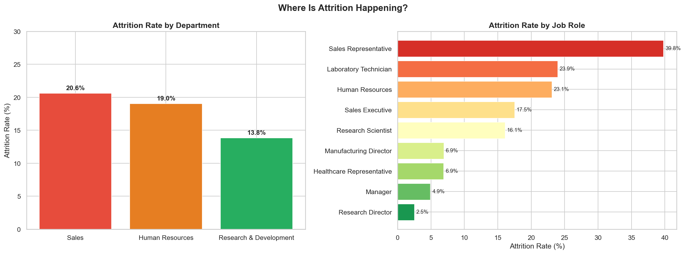
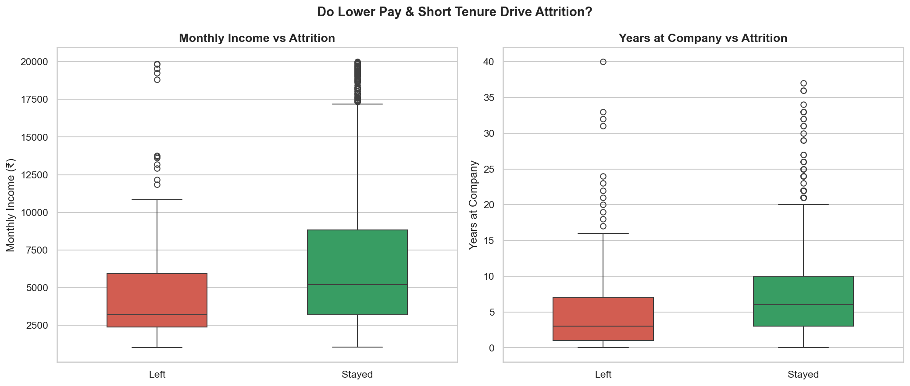
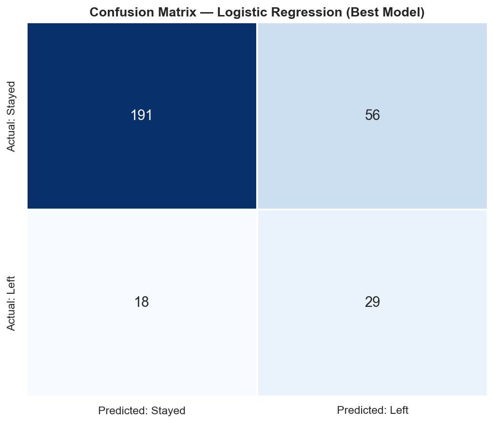
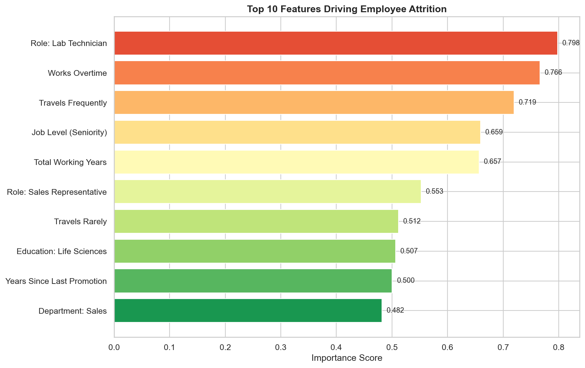
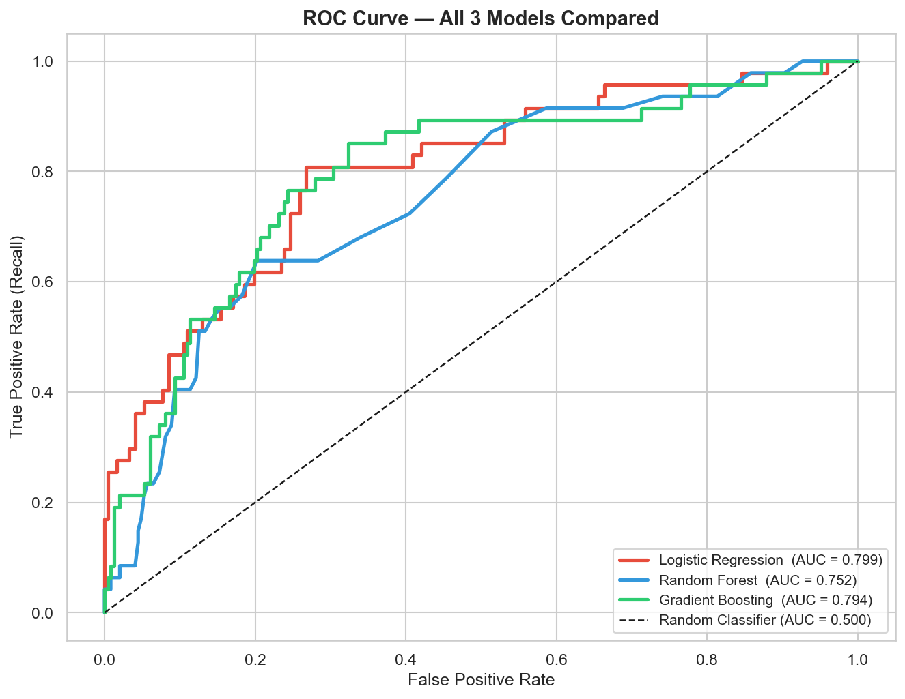

# 👥 Employee Attrition Prediction using Machine Learning
**XYLOFY AI Internship — Week 2 Project**  
**Intern:** Vijay Tiwari | **Batch:** 2023–2027 | **College:** Poornima College of Engineering, Jaipur

---

## 🎯 Problem Statement
Every company loses employees — but losing the right employees at the wrong time costs heavily in hiring, training, and lost productivity. This project builds a Machine Learning system that predicts whether an employee is likely to leave the company, identifies the key drivers of attrition, and delivers actionable insights for an HR team.

---

## 📦 Dataset
**IBM HR Analytics Employee Attrition Dataset**  
🔗 [Kaggle — pavansubhasht](https://www.kaggle.com/datasets/pavansubhasht/ibm-hr-analytics-attrition-dataset)

| Property | Value |
|---|---|
| Rows | 1,470 employees |
| Columns | 35 features |
| Target | Attrition (Yes/No) |
| Attrition Rate | 16.12% (imbalanced) |
| Missing Values | None |

---

## 🛠️ Tools & Libraries


---

## ✅ Project Structure

```
EmployeeAttrition_VijayTiwari/
├── analysis.ipynb                        # Complete notebook — all 7 tasks
├── HR_Attrition.csv                      # Dataset
├── Summary.pdf                           # 1-page HR Director summary
└── charts/
    ├── chart1_attrition_by_dept_role.png
    ├── chart2_income_tenure_boxplot.png
    ├── chart3_confusion_matrix.png
    ├── chart4_feature_importance.png
    └── chart5_roc_curve.png
```

---

## 📊 Key EDA Findings

| Insight | Finding |
|---|---|
| Overall Attrition Rate | 16.12% |
| Highest Attrition Dept | Sales — 20.63% |
| Highest Risk Role | Sales Representative — **39.76%** |
| Avg Income (Left) | ₹4,787/month |
| Avg Income (Stayed) | ₹6,833/month |
| Worst WLB Rating Exit | Rating 1 → **31.25%** attrition |
| Danger Zone Tenure | 0–1 years → 34–36% attrition |

---

## 🤖 Models Trained & Results

| Model | Precision | Recall | F1 Score | ROC-AUC |
|---|---|---|---|---|
| **Logistic Regression** 🏆 | 0.3412 | 0.6170 | 0.4394 | **0.7986** |
| Random Forest | 0.3750 | 0.0638 | 0.1091 | 0.7519 |
| Gradient Boosting | 0.5882 | 0.2128 | 0.3125 | 0.7941 |

> **Best Model: Logistic Regression** — highest ROC-AUC (0.7986) and best Recall (0.617), meaning it catches ~6 out of 10 employees likely to leave. Fully explainable to HR teams — no black box.

> **Why not Random Forest?** Despite being a more powerful model, RF had extremely low Recall (0.064) — it missed 94% of actual leavers. For an HR use case, missing at-risk employees is far more costly than a false alarm.

---

## 🔑 Top 10 Features Driving Attrition

| Rank | Feature | Importance |
|---|---|---|
| 1 | Works Overtime | 0.798 |
| 2 | Travels Frequently | 0.766 |
| 3 | Job Level (Seniority) | 0.719 |
| 4 | Total Working Years | 0.657 |
| 5 | Role: Sales Representative | 0.659 |
| 6 | Travels Rarely | 0.553 |
| 7 | Education: Life Sciences | 0.512 |
| 8 | Years Since Last Promotion | 0.507 |
| 9 | Department: Sales | 0.500 |
| 10 | Role: Lab Technician | 0.482 |

---

## 📈 Charts

### Attrition by Department & Job Role


### Monthly Income & Tenure vs Attrition


### Confusion Matrix — Best Model


### Top 10 Feature Importances


### ROC Curve — All 3 Models


---

## 💡 HR Recommendations

1. **Overtime Monitoring Policy** — Flag employees with consistent overtime for mandatory manager check-ins. Redistribute workload or hire in high-overtime teams, especially in Sales.

2. **90-Day & 1-Year New Joiner Retention Program** — Assign mentors to every new hire, conduct structured 30/60/90 day check-ins, and fast-track salary reviews for high-potential junior employees to reduce early exits.

---

## ⚠️ Model Limitation
This model has a ROC-AUC of ~0.80 — it correctly ranks at-risk employees about 80% of the time but is not perfect. It should be used as a **risk-prioritization tool**, not a definitive verdict. Human judgment and direct manager conversations must always accompany any model prediction.

---

*Vijay Tiwari | XYLOFY AI Internship | Week 2 | June 2026*
